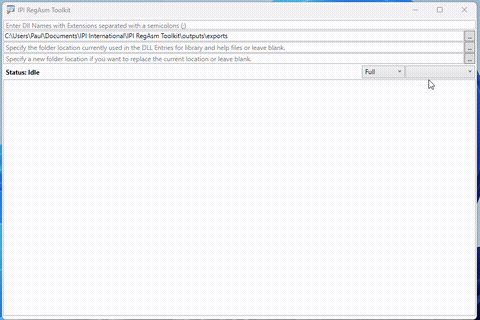
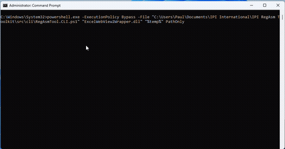
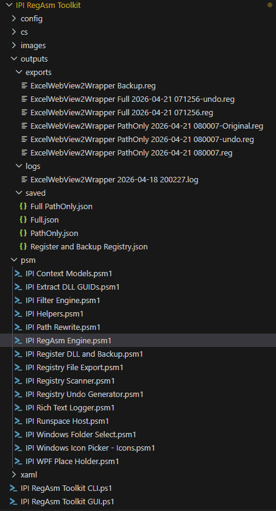
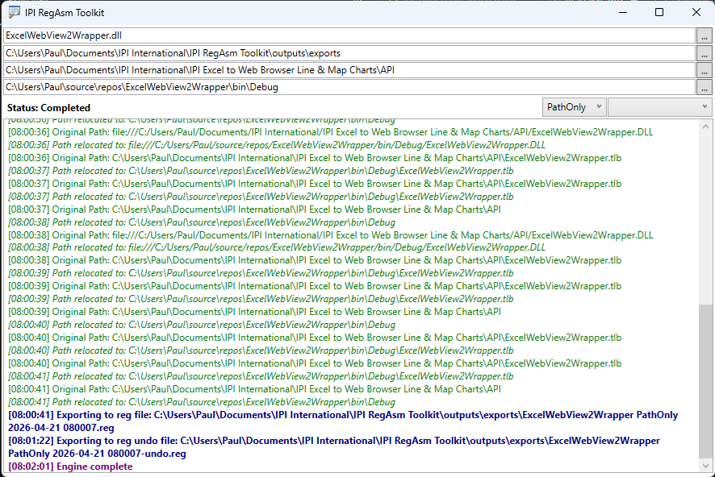
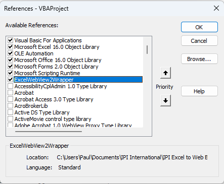
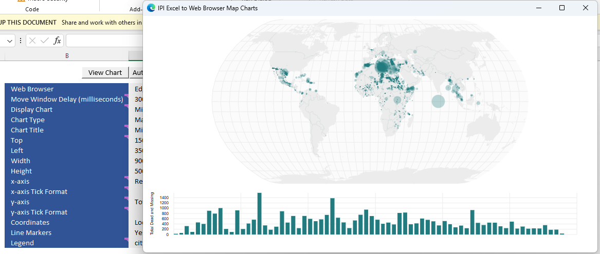
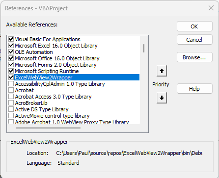
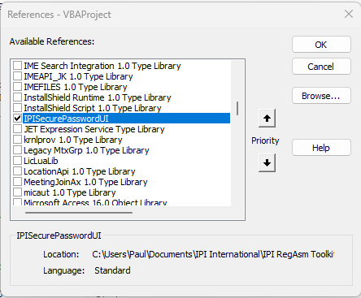
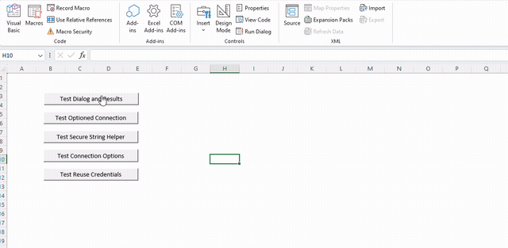

# IPI RegAsm Toolkit

After developing the Excel Ms Edge Web View SDK, I needed to test it in a deployment folder for GitHub and found that I had to change the registry paths its ComObject had been given when running Windows .NET RegAsm. Manually doing so was quite tedious as using Registry Editor's Find function took quite a while to traverse and find all occurences of the DLL. So, I asked ChatGPT and occasionally Gemini for help in building a PowerShell toolset to do the job quicker.

## Toolkit

- ChatGPT gave me the folder structure, file naming convention and code snippets.
- It took a while to guide ChatGPT with the logic that I only wanted registry files to change just the folder/file paths and leave all other registry items relating to the DLL untouched. But, having the full registry items relating to the DLL and Undo was worth having.
- I also noticed when running Windows RegAsm Unregister that some of the keys still remained and I could not add the ComObject in Excel VBA even though it appeared in the References window.
- I then added logic to read the DLL file and retrieve all GUIDs from it. Then removed the Guids already found in the registry scan and again scanned the registry to find all paths relating to GUIDs retrieved from the file. This enabled finding the full GUID set including Interface GUIDs.
- I also added a Remove-Item logic to delete all found GUIDs after running the RegAsm unregister function and found that his finally cleared the registry cleanly.
- I focused on developing the WPF GUI to get everything working the way I had hoped and then had to go back to ChatGPT and query why it had created a manifest and default settings but not applied their logic any where in the rest of the toolkit.
- I also had issues with the code given for the use of runspaces and after a lot of trials and feedback between both ChatGPT and Gemini, I managed to get runspace pools working, but still noted that when run from VS Code and even after closing and disposing everything there were still some lingering objects that caused re-runs to fail. So, I had to close and re-open VS Code on every test run.
- I changed the initial logic to use an output folder rather than file path, as ChatGPT obviously did not catch that using the same file name when you can supply mutliple DLLs would just overwrite the output.
- I also added functions to store and retrieve previous GUI state, as it was doing my head in having to type them in each time for every test run.
- Also, I have not yet implemented the Diff logic in the Export Mode.

- I then turned my focus to the CLI and noticed a few bugs and luckily fixed them on my own ;D
- When using the CLI you can enter just **?** for the DLL Names and it would generate the help/usage output.
- CLI Usage:

`[DLL Names (required - separated by ;/semi colon)] [Output Folder Path (optional)] [SaveLog (optional)] ExportMode (Optional - Full/PathOnly/Diff/Register/BackupOnly) Find Path (optional) Replace Path (optional)`

- I then applied normalisation of Windows path shortcuts like %temp% to enable their use. I think I will leave applying that logic to the find and relocate/replace functions for another day.
- Finally I added in the Register and backup of registration suggested by Gemini.
- I also changed the folder and file naming convention suggested by ChatGPT, to the convention I prefer to use. This caused a lot of things to break, but after an enduring time period, it all started working again.

- When the find and replace parameters are supplied, the PathOnly registry Export will generate 3 files:
  - Original: this dumps the registry entries in their original state.
  - Undo: this dumps only registry entries that have the original folder/file paths.
  - The last file will have only the registry entries with folder/file paths but replaced by the replace parameter.

  
  
- If no find or replace parameters are passed:
  - If the ExportMode is Full, you will get:
    - Undo: all registry entries with a "**-**" symbol infront to remove those registry.
    - A registry restore with all registry keys.
  - If the ExportMode is PathOnly then you will get the same as above, but only keys that contain folder/file paths.
- In the VBA Project of ***IPI Excel to Secure Web View Line & Map Charts.xlsm*** I was able to see that the DLL ComObject was indeed pointing to the Production environment.

- I then tested the function to load the Ms Edge Web view SDK.

- Then I double clicked the registry file to update all folder/file paths to the development environment and checked the VBA Project referrences.

- And again, the Ms Edge Web View SDK worked like a charm.
- I have added a Secure Password API I developed for connecting to SQL Servers along with an Excel workbook to test it with.
- After registering the DLL using this toolkit, load it into the Excel VBA project.

- Click on any of the test buttons in the Excel worksheet to load and run the DLL. Some tests have been set to remember previous entries and you will need to click Cancel to remove them from memory. The password is only ever retrieved on clicking ***OK*** of the Secure Password Window and is not retained in an Excel variable.

